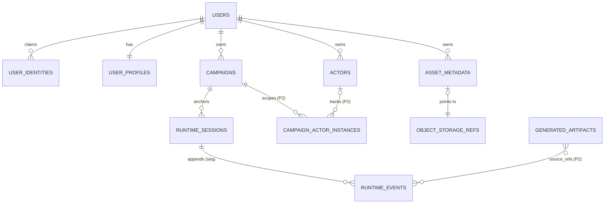

# Postgres Schema — Minimal Model V1 (P5.9)

Status: **planning document only.** No SQL, no migrations, no ORM, no
DATABASE_URL, no dependency, no server/protocol/runtime/UI change. Defines the
first implementation-ready PostgreSQL model that future backend adapters
(implementing the P5.8 `cloudRepositoryContracts`) will realize in P5.10+.

Grounding anchors (all existing, this repo):
- `cloudRepositoryContracts.ts` (P5.8) — the contracts this schema must serve.
- `cloudBackendAdapters.ts` — `AuthIdentity` (providerKind incl.
  `localAnonymous`), `PlatformPermissionContext`, `ObjectStorageRef`,
  `PersistenceBoundaryNote` (primaryDatabase: postgres, runtimeAuthority:
  roomServer).
- `platformObjectIdentity.ts` — identityFactory prefixes (`user_`, `campaign_`,
  `actor` via store ids, `runtimeSession_`, `mediaAsset_`).
- `localUserIdentity.ts` / `actorVaultOwnership.ts` / `campaignOwnership.ts` —
  the P5.1–P5.3 local records that will migrate in (see the companion
  LOCAL_TO_CLOUD_MIGRATION_PLAYBOOK_V1).
- `roomRuntimeLogTypes.ts` — `RoomRuntimeLogEvent` (server-assigned per-room
  monotonic `seq`, `visibility`, `latestSeq`/`afterSeq` cursor).
- P4 audits: IDENTITY_REFERENCE_OWNERSHIP_AUDIT_V1,
  RUNTIME_EVENT_REPLAY_BOUNDARY_AUDIT_V1,
  PERSISTENCE_TRANSACTION_BOUNDARY_AUDIT_V1,
  CLOUD_IDENTITY_FOUNDATION_IMPLEMENTATION_PLAN_V1 (ownership matrix).

---

## 1. Design Goals

PostgreSQL is introduced as the **durable system of record for user-owned
platform data** — identity, campaigns, actors, session event history, and asset
metadata — so that data survives devices and enables future multi-device /
multi-user play. It is explicitly NOT a live game-state engine.

Hard rules (all inherited, none new):
- The database sits **behind backend repository adapters**. The frontend NEVER
  talks to Postgres; it talks to an API that implements the P5.8 contracts.
- **Local adapters remain active.** Cloud is additive; offline-first local play
  is a feature to preserve (P5.1 conclusion), not a legacy mode.
- **Cloud adapters implement `cloudRepositoryContracts.ts`** — the contract
  shapes are fixed there; this document maps them to tables.
- **Room Server remains the live runtime authority** during a session
  (`runtimeAuthority: 'roomServer'`). Postgres persists runtime events; it does
  not arbitrate them in real time.
- **RuntimeEvent persistence is append-only** (P4.4): no UPDATE/DELETE of event
  rows; corrections happen via new correction/tombstone events.
- **AI artifacts are non-authoritative**: they live in their own table and only
  become domain state through explicit human-confirmed domain events.

What the MVP database stores: users + identities + profiles, campaigns
(metadata + payload snapshot), actors (metadata + sheet payload), runtime
sessions + events, asset metadata + object storage refs. Nothing else.

---

## 2. MVP vs Later Table Classification

| Table | Phase | Reason |
| --- | --- | --- |
| `users` | **MVP** | Root of all ownership; nothing works without it. |
| `user_identities` | **MVP** | Claim/link of localAnonymous + future providers; multi-provider from day one prevents a painful retrofit. |
| `user_profiles` | **MVP** | Already a live local shape (P5.1 `UserProfile`); cheap. |
| `campaigns` | **MVP** | First user-visible cloud asset; upload target of P5.3 data. |
| `actors` | **MVP** | Second upload target (P5.2 data); needed for cross-device sheets. |
| `runtime_sessions` | **MVP** | Anchor for the event stream; trivially small. |
| `runtime_events` | **MVP** | Append-only history is the platform's core long-term value; deferring it would force a second schema round. |
| `asset_metadata` | **MVP** | Portraits/maps already exist as URL refs; metadata is cheap and unblocks upload flows. |
| `object_storage_refs` | **MVP** | Companion of asset_metadata; refs only, no blob IO. |
| `campaign_memberships` | **Phase 2** | No sharing/membership product yet (explicitly out of P5 scope). Owner-only access needs no rows. |
| `campaign_actor_instances` | **Phase 2** | Campaign-scoped HP/SAN/inventory authority — see §8; boundary doc exists (campaign-actor-instance-boundary.md) but no product surface yet. |
| `runtime_event_checkpoints` | **Phase 2** | Optimization; correct without it at MVP volumes. |
| `generated_artifacts` | **Phase 2** | AI Host is explicitly out of scope; reserve shape only (§12). |
| `ai_artifact_reviews` | **Future** | Depends on generated_artifacts having real traffic. |
| `workshop_packages` / `_versions` / `_dependencies` / `workshop_subscriptions` | **Future** | Workshop is mock/seed today; never prioritize before User/Campaign/Actor/RuntimeEvent. |
| `room_metadata` / `room_members` | **Future** | Rooms are in-memory Room Server authority by design; persisting them is a separate server-side decision (P4.5), not a frontend-driven one. |
| presence / ephemeral state | **Never in Postgres** | Ephemeral by definition; lives in Room Server memory (later maybe Redis-class infra behind an adapter). |

---

## 3. Recommended MVP Table Set

Conventions for ALL tables (stated once):
- **IDs are opaque domain strings** minted by `identityFactory` semantics:
  `user_<uuid>`, `campaign_<uuid>`, `runtimeSession_<uuid>`, `event_<uuid>`,
  `mediaAsset_<uuid>`. `TEXT PRIMARY KEY`. **No auto-increment integers as
  domain ids** (integers may exist as internal partition/cluster keys later,
  never exposed).
- Timestamps: `created_at` (NOT NULL), `updated_at`, plus `archived_at` /
  `deleted_at` (soft delete only; hard delete is a separate, audited operation
  per DATA_LIFECYCLE_AND_DELETION_POLICY_V1).
- JSONB payloads always carry a sibling `schema_version INTEGER NOT NULL`
  column; upcasting happens in the adapter on read (same pattern as zustand
  persist migrate today).
- `owner_id` always means **asset ownership metadata** referencing
  `users.user_id` — never a permission decision by itself.

### 3.1 `users`
- Purpose: canonical platform user (the future cloud counterpart of the P5.1
  local anonymous user).
- PK: `user_id TEXT` (`user_<uuid>` — the SAME id space as identityFactory,
  so a claimed local user can keep its id; see §4).
- Columns: `display_name TEXT`, `status TEXT` (`active|suspended|deleted`),
  `schema_version`, timestamps.
- No provider fields here (they live in `user_identities`).
- Indexes: PK only at MVP.

### 3.2 `user_identities`
- Purpose: provider-neutral identity links (one user, many identities).
- PK: `identity_id TEXT`.
- Columns: `user_id FK→users`, `provider_kind TEXT`
  (`localAnonymous|external|custom|unknown` — mirrors `CloudAuthProviderKind`),
  `provider_subject TEXT` (provider's stable subject/user id; for
  `localAnonymous` this is the device-minted `user_<uuid>`),
  `display_name`, `email`, `claimed_at`, `schema_version`, timestamps.
- Unique: `(provider_kind, provider_subject)` — THE duplicate-account guard.
- Index: `user_id`.
- Never stores raw provider token/JWT/objects — identification only.

### 3.3 `user_profiles`
- Purpose: showcase profile (mirrors `UserProfile` in `userProfile.ts`).
- PK: `user_id FK→users` (1:1).
- Columns: `handle TEXT UNIQUE`, `display_name`, `bio`,
  `avatar_media_asset_id FK→asset_metadata NULLABLE`, `banner_media_asset_id`,
  `tags JSONB`, `visibility TEXT` (`private|unlisted|public|campaignOnly`),
  `pinned JSONB`, `section_visibility JSONB`, `schema_version`, timestamps.

### 3.4 `campaigns`
- Purpose: durable campaign record (cloud counterpart of `LocalCampaign` +
  P5.3 ownership).
- PK: `campaign_id TEXT` (`campaign_<uuid>` — local ids can be preserved on
  upload when they don't collide; see playbook).
- Columns: `owner_id FK→users NOT NULL`, `system_id TEXT NOT NULL`
  (`dnd5e-2024|coc7e|cp-red`), `title TEXT NOT NULL`, `description TEXT`,
  `room_code TEXT` (display code, NOT a permission), `status TEXT`
  (`draft|active`), `lifecycle_status TEXT` (`active|archived|trashed`),
  `payload JSONB` (full LocalCampaign-compatible snapshot for import/export
  fidelity), `schema_version`, timestamps + `archived_at`/`trashed_at`.
- Note: ownership becomes a **first-class column** in cloud — the local P5.3
  registry was additive only because the local schema could not change safely;
  the registry is a *migration source*, not a table.
- Unique: none beyond PK at MVP (`room_code` is per-owner display data;
  uniqueness enforcement deferred until sharing exists).
- Indexes: `(owner_id, updated_at DESC)`, `(owner_id, system_id)`.

### 3.5 `actors`
- Purpose: vault character records (cloud counterpart of `ActorVaultRecord` +
  per-system sheet payload + P5.2 ownership).
- PK: `actor_id TEXT` (cloud-minted `actor_<uuid>`; the original local store id
  is preserved as `local_actor_id` because local ids are per-system store ids
  with no global uniqueness guarantee).
- Columns: `owner_id FK→users NOT NULL`, `system_id TEXT NOT NULL`,
  `local_actor_id TEXT`, `display_name TEXT`, `subtitle TEXT`,
  `lifecycle_status TEXT` (`active|archived|trashed`),
  `payload JSONB NOT NULL` (the full system-specific sheet — opaque to the
  platform, exactly like `saveActorSnapshot(snapshot: unknown)` in P5.8),
  `payload_schema_version INTEGER` (the per-system store schema version),
  `schema_version`, timestamps.
- Unique: `(owner_id, system_id, local_actor_id)` — idempotent re-upload guard.
- Indexes: `(owner_id, system_id, updated_at DESC)`.

### 3.6 `runtime_sessions`
- Purpose: anchor one play session's event stream.
- PK: `runtime_session_id TEXT` (`runtimeSession_<uuid>`).
- Columns: `campaign_id FK→campaigns NULLABLE` (ad-hoc rooms may have none),
  `room_id TEXT` (Room Server id — copied metadata, NOT an FK; rooms are not
  persisted at MVP), `host_user_id FK→users NULLABLE` (**session host
  identity — this is where hostUserId truly lives**, distinct from
  `campaigns.owner_id`), `system_id`, `started_at`, `ended_at`,
  `latest_seq BIGINT NOT NULL DEFAULT 0` (cursor head; see §9/§15),
  `schema_version`, timestamps.
- Indexes: `(campaign_id, started_at DESC)`.

### 3.7 `runtime_events` (append-only)
- Purpose: durable, replayable event history (P4.4).
- PK: `event_id TEXT` (`event_<uuid>`, server-assigned).
- Columns: `runtime_session_id FK→runtime_sessions NOT NULL`,
  `seq BIGINT NOT NULL` (server-assigned, monotonic per session),
  `campaign_id TEXT NULLABLE` (denormalized for campaign-history reads),
  `room_id TEXT`, `author_user_id TEXT NULLABLE`, `author_member_id TEXT`
  (live-session member identity), `actor_ref TEXT NULLABLE`,
  `event_kind TEXT NOT NULL` (mirrors `RoomRuntimeLogEventKind`, open set),
  `visibility TEXT NOT NULL` (`public|hostOnly|actorPrivate`),
  `payload JSONB`, `idempotency_key TEXT NULLABLE`,
  `correlation_id TEXT NULLABLE`, `caused_by_event_id TEXT NULLABLE`,
  `created_at NOT NULL`, `schema_version`.
- **No `updated_at`, no `deleted_at`: rows are immutable.** Corrections append
  a new event with `event_kind: 'correction'`/`'tombstone'` pointing at
  `caused_by_event_id` (RUNTIME_LOG_LIFECYCLE_CORRECTION_POLICY_CONTRACT_V1).
- Unique: `(runtime_session_id, seq)`; `(runtime_session_id, idempotency_key)`
  WHERE idempotency_key IS NOT NULL (retry-safe append).
- Indexes: PK, the two uniques, `(campaign_id, created_at)`.

### 3.8 `asset_metadata`
- Purpose: metadata for user assets (portraits/maps/handouts) — bytes NEVER in
  Postgres.
- PK: `asset_id TEXT` (`mediaAsset_<uuid>` — matches identityFactory's
  Artifact→mediaAsset mapping).
- Columns: `owner_id FK→users NOT NULL`, `title`, `asset_kind TEXT`
  (`portrait|map|handout|audio|other`), `visibility TEXT`,
  `content_hash TEXT`, `mime_type TEXT`, `size_bytes BIGINT`,
  `storage_ref_id FK→object_storage_refs NULLABLE` (nullable: URL-reference
  assets from today's static-map v0-lite have no managed blob),
  `source_url TEXT NULLABLE`, `schema_version`, timestamps + soft-delete.
- Indexes: `(owner_id, created_at DESC)`, `content_hash` (dedupe assist).

### 3.9 `object_storage_refs`
- Purpose: vendor-neutral pointer into S3-compatible object storage (mirrors
  `ObjectStorageRef` in cloudBackendAdapters).
- PK: `storage_ref_id TEXT`.
- Columns: `provider_kind TEXT` (`s3Compatible|custom|unknown`), `bucket TEXT`,
  `object_key TEXT`, `content_type`, `size_bytes`, `checksum`,
  `public_url TEXT NULLABLE`, `schema_version`, timestamps.
- Unique: `(provider_kind, bucket, object_key)`.
- No blob IO in P5.10; the table can exist empty.

---

## 4. Identity and Claim Strategy

- **localAnonymous today:** the device mints `user_<uuid>` (P5.1) with
  `AuthIdentity.providerKind = 'localAnonymous'`. This id is real and stable.
- **Claim = insert, not rewrite.** When a local user later logs in with an
  external provider, the backend: (a) finds-or-creates the `users` row, (b)
  inserts a `user_identities` row for the external provider, and (c) inserts a
  `user_identities` row `(provider_kind='localAnonymous',
  provider_subject=<device user_id>)` linking the device identity to that user.
  Local data uploaded afterwards is owned by the claimed cloud user.
- **Preferred id outcome:** if the device's `user_<uuid>` does not collide, the
  cloud `users.user_id` CAN adopt it (same id space by design) — this makes
  first-device claim a no-rename operation. On collision (or second device),
  the cloud user keeps its existing id and the device id lives only in
  `user_identities.provider_subject`.
- **Duplicate prevention:** the `(provider_kind, provider_subject)` unique
  constraint makes claiming idempotent and prevents one external account from
  becoming two users, and one device identity from linking to two users
  (second attempt → `conflict` error via the P5.8 error boundary).
- **Provider-neutral:** core tables never store provider raw objects/tokens;
  `AuthIdentity`-shaped fields only. Vendor auth SDK output is translated at
  the API boundary (P4.6), consistent with `CloudRepositoryViewer` rules.
- **Multiple devices:** each device has its own localAnonymous id; each is
  claimed as an additional `user_identities` row of the SAME user. Their local
  data is uploaded under the same `owner_id`; per-entity conflicts are handled
  by the migration playbook (dry-run + idempotency keys), not by identity.

No login is implemented now; this section only fixes the table semantics so
P5.10+ cannot paint the claim flow into a corner.

---

## 5. Ownership Model

- `users → campaigns.owner_id`, `users → actors.owner_id`,
  `users → asset_metadata.owner_id`, (future) `users →
  workshop_packages.author_id`.
- `campaigns → campaign_actor_instances.campaign_id` (Phase 2): the INSTANCE
  belongs to the campaign; the vault actor keeps its own owner.
- Room/Runtime **membership is a relation, not ownership**: being in a session
  never transfers `owner_id`; `runtime_sessions.host_user_id` records who
  hosted, nothing more.

Semantics (fixed vocabulary, same as repositoryServices P5.7 glossary):
- `owner_id` = asset ownership metadata.
- `host_user_id` = live/session host identity.
- viewer = access perspective (`CloudRepositoryViewer`), evaluated per call.
- membership = access relation (Phase 2 table), never an owner substitute.
- **Permissions are DERIVED at the service/repository boundary** from
  owner + membership + visibility + role — there are **no ACL blobs** scattered
  in rows. Visibility stays a single enum column per aggregate.

---

## 6. Campaign Model

- Metadata columns (title/system/status/lifecycle) are promoted to real
  columns because lists, filters and indexes need them; everything else rides
  in `payload JSONB` as a LocalCampaign-compatible snapshot.
- **Import/export compatibility:** `payload` uses the SAME shape as the local
  export envelope (EXPORT_IMPORT_ENVELOPE_V2 discipline), so
  local→cloud upload and cloud→local download reuse the proven
  preview/safe-append machinery.
- Archived/trashed = `lifecycle_status` + timestamps (identical semantics to
  the local store; recover keeps owner).
- Future membership/sharing adds `campaign_memberships` rows — no campaign
  column changes needed.
- **`campaignRef` in the Room Server must NOT become DB authority:** it is a
  display-time metadata copy inside the room protocol (roomTypes). The DB
  campaign row is the asset; the room's campaignRef stays a read-only echo.
  Making the room ref authoritative would invert the P4 authority direction
  (rooms are ephemeral; campaigns are durable).

## 7. Actor / Character Model

- Id strategy: cloud-minted `actor_<uuid>` + preserved
  `(system_id, local_actor_id)` origin (unique per owner) — because local
  actor ids are only unique within one device's one-system store.
- `payload JSONB` holds the full per-system sheet (DND/COC/CP-RED shapes stay
  system-internal; the platform never normalizes them — same stance as
  P5.8 `saveActorSnapshot(snapshot: unknown)`).
- `payload_schema_version` carries the per-system store version so the
  existing store `migrate` logic can upcast on download.
- Ownership: `owner_id` column (P5.2 registry is the migration source).
- Actor snapshots (runtime-facing read copies) are NOT separate MVP rows —
  they are derived reads; if snapshot history is ever needed it becomes a
  Phase-2 concern tied to campaign_actor_instances.
- **Vault actor vs campaign actor instance stay separate** (existing
  boundary doc): the vault sheet is the player's durable property; campaign
  play state (HP/SAN/conditions/inventory-in-campaign) belongs to the
  campaign's instance. Runtime state is never collapsed back into the vault
  row.

## 8. Campaign Actor Instance Model — Phase 2 (decided)

Not MVP because: no cloud membership yet, no cross-device shared campaign
state product surface, and the Room Server currently carries live bindings.
Eventually required because campaign-specific HP/SAN/resources/inventory need
an authority that is neither the vault sheet (player property) nor the room
(ephemeral). Shape sketch: `instance_id` PK, `campaign_id FK`,
`actor_id FK NULLABLE` (an instance may outlive or predate a vault link),
`player_user_id`, `state JSONB` + `schema_version`, timestamps. Runtime
snapshots reference the instance; local actor-ownership registry cannot
express any of this (it maps actor→owner only, no campaign scoping) — which is
exactly why this table exists later.

## 9. Runtime Session and Runtime Event Model

Covered structurally in §3.6/§3.7. The rules that matter:

- `seq` is **server-assigned** in cloud mode, monotonic per
  `runtime_session_id`, starting at 1 — identical to the live Room Server
  behavior (`roomRuntimeLogTypes` "Server-assigned, monotonic per room").
- Append algorithm (single transaction, see §15): lock/update
  `runtime_sessions.latest_seq = latest_seq + 1`, insert the event row with
  that seq. `(runtime_session_id, seq)` unique is the integrity backstop.
- Reads paginate with `afterSeq` (`WHERE seq > $afterSeq ORDER BY seq LIMIT n`)
  — never OFFSET. `latest_seq` is returned as the next cursor (the existing
  client contract: don't use `max(events.seq)` because withheld non-public
  events create gaps).
- `visibility` is projection metadata; the BACKEND projects per viewer
  (public vs hostOnly vs actorPrivate) exactly as the Room Server does today.
- `idempotency_key` makes retried appends safe; `correlation_id` groups
  multi-event operations; `caused_by_event_id` links corrections/tombstones.
- Correction strategy: append-only corrections (`correction`/`tombstone`
  kinds); readers apply them at projection time. No row mutation, ever.
- `runtime_event_checkpoints` (Phase 2): periodic
  `(runtime_session_id, seq, snapshot JSONB)` rows to bound replay cost —
  optimization only.
- **RuntimeLog does not live in RoomSnapshot** (existing protocol rule kept).
- **AI cannot write authoritative events**; AI output lands in
  `generated_artifacts` and only a human-confirmed flow appends a domain
  event referencing the artifact.
- **Room Server remains live authority during the session**; Postgres ingest
  is a persistence concern behind the server adapter ports
  (`runtime.event.append` in serverAdapterPorts), wired in a LATER server
  task — never from the frontend.

## 10. Asset and Object Storage Model

Covered structurally in §3.8/§3.9. Rules: binary blobs never in Postgres;
`asset_metadata` ↔ `object_storage_refs` separates domain metadata from
storage location so providers can change without touching domain rows;
`content_hash`+`size_bytes` enable dedupe and integrity checks; portraits/
maps/handouts/workshop resources all reference `asset_id` (mediaAsset id
space already used by `actorMediaBinding`/`mediaNodeTypes`). S3-compatible
implementation comes later; nothing is implemented now.

## 11. Workshop / Package Model — Future (decided)

Sketch only: `workshop_packages` (package_id, author_id FK→users, title,
visibility, latest_version_id), `workshop_package_versions` (version_id,
package_id, semver, **immutable payload JSONB**, published_at),
`workshop_package_dependencies` (version_id, depends_on_package_id,
version_range), `workshop_subscriptions` (user_id, package_id, subscribed_at).
Immutable versions + dependency edges match WORKSHOP_PACKAGE_MANIFEST_V1.
Explicitly deprioritized behind User/Campaign/Actor/RuntimeEvent.

## 12. Generated Artifact / AI Model — Phase 2 shape (reserved)

`generated_artifacts`: `artifact_id` PK, `generated_by TEXT` (model/agent id,
not a user), `requested_by_user_id FK→users`, `artifact_type TEXT`,
`status TEXT` (`draft|accepted|rejected`), `payload JSONB`,
`source_refs JSONB` (list of `event_id`/entity refs the artifact was derived
from), `reviewed_by_user_id NULLABLE`, `reviewed_at`, `schema_version`,
timestamps. Rules: never authoritative; acceptance is a HUMAN action that
appends a proper domain `runtime_event` (or domain mutation) referencing
`artifact_id`; rejection just flips status. `ai_artifact_reviews` (Future)
would add multi-reviewer audit if ever needed.

## 13. Mermaid ER Diagram

## 14. Repository Mapping (P5.8 contracts → tables)

| Contract | Reads | Writes | Must NOT do | Transactions | Key indexes |
| --- | --- | --- | --- | --- | --- |
| CloudUserRepositoryContract | users, user_identities, user_profiles | users, user_identities, user_profiles | expose provider raw objects; delete identities silently | create user+identity atomic (§15.1); claim atomic (§15.2) | `(provider_kind, provider_subject)` unique |
| CloudCampaignRepositoryContract | campaigns (by owner, by id) | campaigns insert/update/lifecycle | hard delete; touch runtime_events; enforce permissions itself (service does) | single-row writes; upload = one insert | `(owner_id, updated_at)` |
| CloudActorRepositoryContract | actors; ownership answered from `owner_id` | actors insert/update payload | normalize per-system payload; write campaign instance state | single-row; upload idempotent via `(owner_id, system_id, local_actor_id)` | `(owner_id, system_id, updated_at)` |
| CloudRuntimeEventRepositoryContract | runtime_events afterSeq; runtime_sessions.latest_seq | INSERT events only (+ latest_seq bump) | UPDATE/DELETE events; client-assigned seq; serve unprojected hostOnly to non-hosts | append+bump atomic (§15.5) | `(runtime_session_id, seq)` unique |
| CloudAssetMetadataRepositoryContract | asset_metadata (+ join refs) | asset_metadata, object_storage_refs | store blobs; mint public URLs itself | metadata+ref atomic (§15.6) | `(owner_id, created_at)` |

## 15. Transaction Boundaries

1. **Create user + first identity** — one transaction (users +
   user_identities). Partial user without identity is unreachable data.
2. **Claim local anonymous user** — one transaction: insert localAnonymous
   identity row (+ optionally adopt id). Idempotent by the unique constraint;
   re-claim returns `conflict` per the P5.8 error shape.
3. **Create campaign (+ future owner membership)** — MVP: single insert.
   Phase 2: campaign + membership row in one transaction.
4. **Upload actor + ownership** — single insert (ownership IS the owner_id
   column); re-upload is an idempotent upsert on the origin unique key.
5. **Append runtime event + bump latest_seq** — ONE transaction, the only
   truly hot path: `UPDATE runtime_sessions SET latest_seq = latest_seq + 1
   … RETURNING`, then INSERT with that seq. Checkpoint writes (Phase 2) may
   be eventual.
6. **Upload asset metadata + object ref** — one transaction (ref row +
   metadata row).
7. **Accept AI artifact → append domain event** — one transaction: flip
   artifact status + append the referencing runtime_event, so an accepted
   artifact can never lack its domain event.

Eventual consistency is acceptable for: checkpoints, denormalized
`runtime_events.campaign_id` backfill, profile section counters, and any
search/index projections. It is NOT acceptable for seq assignment, identity
claim, or ownership writes.

## 16. Indexing and Pagination

Initial index set (complete list):
`campaigns(owner_id, updated_at DESC)` · `actors(owner_id, system_id,
updated_at DESC)` · `runtime_events(runtime_session_id, seq) UNIQUE` ·
`runtime_events(campaign_id, created_at)` · `asset_metadata(owner_id,
created_at DESC)` · `user_identities(provider_kind, provider_subject) UNIQUE`
· Phase 2: `campaign_memberships(user_id, campaign_id) UNIQUE` ·
`workshop_packages(author_id, updated_at DESC)`.

Pagination rules: all list reads are **cursor-based** (opaque cursor =
encoded `(updated_at, id)` keyset; matches `CloudRepositoryPage.nextCursor`);
runtime events use **afterSeq only**; **no OFFSET pagination anywhere**, and
especially never on event streams.

## 17. Security and Access Boundary

- The schema is NOT permission logic: visibility/owner columns are inputs;
  the backend service layer derives decisions per `CloudRepositoryViewer`
  (same projection discipline as `repositoryServices`/`decideProjection`).
- Repositories receive viewer context; they never read auth headers or
  vendor sessions themselves.
- Database constraints protect INTEGRITY (uniques, FKs, NOT NULLs), not
  authorization.
- No frontend direct DB access — DATABASE_URL exists only server-side
  (readiness checklist §5).
- No raw provider auth objects anywhere in core tables or repository code.

## 18. Explicitly Not Implemented

SQL files, migrations, ORM/query layer choice, database connection,
DATABASE_URL, auth providers/login, API endpoints, server changes, Room
Server/WebSocket changes, object storage IO, membership/sharing, workshop
tables, AI artifact flows, presence persistence, UI.

## 19. P5.10 Readiness Checklist

- [ ] MVP table set (§3) approved by owner
- [ ] ID strategy (opaque prefixed strings; actors keep origin key) approved
- [ ] Claim/link strategy (§4) approved
- [ ] owner/host/viewer/membership semantics (§5) approved
- [ ] RuntimeEvent seq strategy (server-assigned; append+bump txn) approved
- [ ] Transaction boundaries (§15) approved
- [ ] ORM/query layer **still undecided** (decision matrix lives in
      POSTGRES_ADAPTER_READINESS_CHECKLIST_V1 §3)
- [ ] No database implementation exists yet (this document changed nothing)
